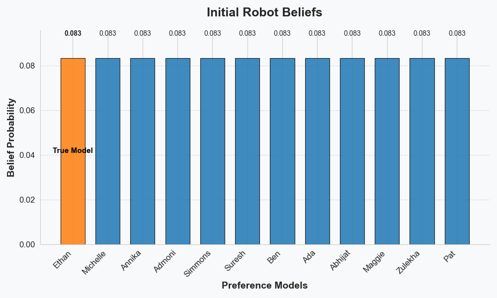
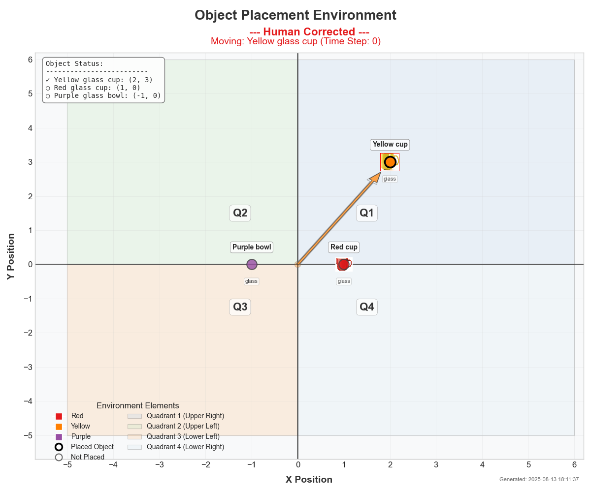

# Clarifying Feature Overspecification in Reward Learning from State Corrections via Follow Up Questions

<!-- Badges -->


---

## 🚀 Introduction

Clarification-Guided Reward Learning is a research project from the 2024 CMU RISS program focused on enabling robots to learn user preferences through interactive corrections and clarification questions. The goal is to make robots more adaptive and aligned with human intent in collaborative tasks.

---

## 📖 Description

This project explores how robots can learn reward functions from human state corrections, using proactive dialogue to resolve ambiguity. The system uses Bayesian inference to update beliefs about user preferences and features a modular, extensible codebase for experimentation.

Key features:
- Interactive human-robot collaboration with state corrections
- Clarification questions to resolve feature ambiguity
- Probabilistic (Bayesian) belief updates
- Modular MDP and preference model framework

---

## 🖼️ Visuals

<p align="center">
	
	<br>
	<em>Example: Initial robot belief distribution over preference models</em>
</p>

<p align="center">
	
	<br>
	<em>Example: State visualization from a rollout</em>
</p>

---

## 📦 Prerequisites / Requirements

- Python 3.8+
- Recommended: virtualenv or conda
- Install dependencies:
	```bash
	pip install -r requirements.txt
	```

---

## 🛠️ Technologies Used

- Python 3.8+
- numpy, matplotlib, seaborn, networkx
- Custom logging utilities (see `src/utils/console.py`)

---

## ⚡ QuickStart Guide

1. Clone the repository:
	 ```bash
	 git clone https://github.com/ethanvillalovoz/clarification-guided-reward-learning.git
	 cd clarification-guided-reward-learning
	 ```
2. Install dependencies:
	 ```bash
	 pip install -r requirements.txt
	 ```
3. Run the main experiment:
	 ```bash
	 python src/clarification_guided_interaction.py
	 ```
4. View belief visualizations in the `beliefs/` folder.

---

## 🔬 Advanced Usage

- Modify `src/clarification_guided_interaction.py` to change the experiment setup, objects, or interaction protocol.
- Add new preference models or object types in `src/multi_object_mdp.py`.
- Use or extend utility scripts in `archive/utility_scripts/` for data processing or visualization.

---

## ⚙️ Configuration

- All main configuration is done in `src/clarification_guided_interaction.py` and `src/multi_object_mdp.py`.
- For advanced customization, see the comments in each file and the [USAGE_GUIDE.md](src/USAGE_GUIDE.md).

---

## ✅ Automated Test

*Basic test functions are included in `src/multi_object_mdp.py`.*

To run tests (if implemented):
```bash
python -m unittest discover src/
```

---

## 🗂️ Directory Structure

```
clarification-guided-reward-learning/
├── archive/           # Legacy code, rollouts, and utility scripts
├── beliefs/           # Belief visualization images
├── data/              # Object images and data
├── docs/              # Documentation (paper, poster, presentation, video)
├── rollouts/          # Rollout images from experiments
├── src/               # Main source code
│   ├── clarification_guided_interaction.py
│   ├── multi_object_mdp.py
│   ├── USAGE_GUIDE.md
│   └── utils/
│       └── console.py
├── requirements.txt   # Python dependencies
├── LICENSE            # MIT License
└── README.md          # This file
```

---

## 🛣️ Roadmap

- [ ] Enhanced question generation using LLMs
- [ ] User studies for real-world validation
- [ ] More advanced belief update mechanisms
- [ ] Integration with physical robots
- [ ] Improved visualization and user interface

---

## 🤝 Contribution

Contributions are welcome! Please see [CONTRIBUTING.md](CONTRIBUTING.md) if available, or open an issue or pull request. For major changes, please discuss them first.

---

## 🔍 Future Work & Development Ideas

- Enhance the generation of clarification questions using advanced large language models (LLMs).
- Conduct user studies to validate findings in real-world scenarios.
- Apply the methodology to other domains requiring close human-robot collaboration.

**Future Development Ideas:**

1. **Enhanced Question Generation**
	- Generate questions dynamically based on the robot's uncertainty
	- Prioritize questions that maximize information gain
	- Use natural language generation for more natural dialogue

2. **Improved Belief Updates**
	- Implement more sophisticated Bayesian update mechanisms
	- Add confidence-weighted updates based on human certainty
	- Handle noisy or inconsistent human feedback

3. **Natural Language Integration**
	- Allow open-ended natural language responses
	- Use semantic parsing to extract relevant information
	- Build a knowledge graph of preferences over time

4. **Active Learning Strategies**
	- Implement information-theoretic query selection
	- Balance exploration vs. exploitation in question asking
	- Design questions to disambiguate between competing hypotheses

5. **User Experience Improvements**
	- Add visualization of belief evolution over time
	- Provide explanations for robot's decisions
	- Allow reviewing and revising past interactions

---

## 👏 Acknowledgments

This work was conducted as part of the **CMU Robotics Institute Summer Scholars (RISS) Program 2024**. I would like to thank:

- **Dr. Henny Admoni** and **Dr. Reid Simmons** for their guidance and support.
- **Michelle Zhao** for her invaluable mentorship.
- **Rachel Burcin** and **Dr. John Dolan** for leading the RISS Program and providing this incredible opportunity.

---

## 📝 License

This project is licensed under the [MIT License](LICENSE).

---

## 💬 Contact

For questions or collaborations:
- **Email:** ethan.villalovoz@gmail.com
- **GitHub:** [ethanvillalovoz](https://github.com/ethanvillalovoz)
