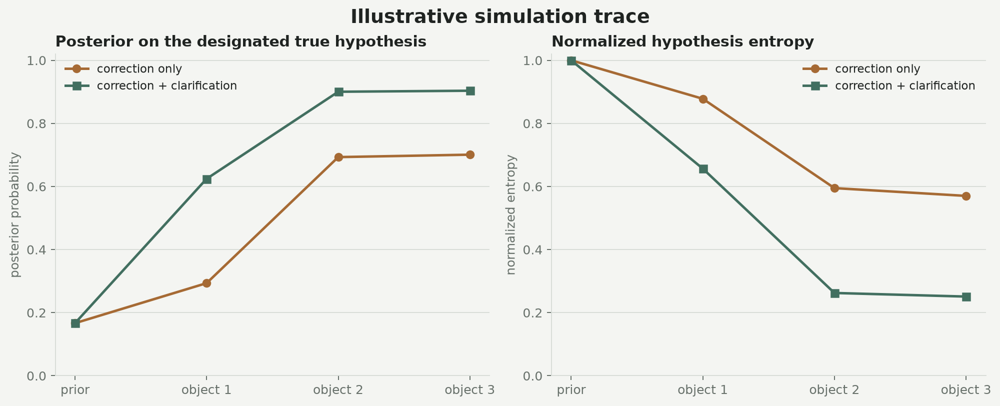

# Clarification-Guided Reward Learning

[](https://github.com/ethanvillalovoz/clarification-guided-reward-learning/actions/workflows/ci.yml)
[](https://www.python.org/)
[](LICENSE)

A correction tells a robot which state a person preferred. It does not tell the robot why. This simulation tests whether one short follow-up question can separate reward hypotheses that all fit the same corrected state.



## Research Status

I started this simulation during the 2024 Carnegie Mellon Robotics Institute Summer Scholars program. The working paper had no user-study results, so the claim here stays narrow: the code implements the proposed inference mechanism and tests it inside a fixed toy hypothesis space.

It does **not** establish that clarification improves real-robot performance, task completion time, user satisfaction, or generalization.

## Research Question

A state correction can be overspecified. If a person moves a red glass cup from one dishwasher quadrant to another, the robot observes the preferred state but not the reason: color, material, object type, or a conjunction of features.

This reference implementation compares two conditions on the same deterministic sequence:

1. **Correction only:** update reward-hypothesis beliefs from the corrected state.
2. **Correction + clarification:** apply the same correction update, then ask which object features motivated the correction when posterior entropy remains high.

## Method

For a human-corrected state `S_h`, robot state `S_r`, reward hypothesis `theta`, and rationality parameter `beta`, the correction likelihood uses a Bradley-Terry model:

```text
P(S_h > S_r | theta) = exp(beta R_theta(S_h))
                         -----------------------------------------
                         exp(beta R_theta(S_h)) + exp(beta R_theta(S_r))
```

The posterior is the normalized product of prior and likelihood. A feature answer uses the paper's illustrative noise model: likelihood `0.8` for an exact feature-structure match and `0.2` otherwise. Clarification is gated by normalized entropy rather than asked unconditionally.

The code keeps each assumption explicit in [`inference.py`](src/clarification_reward_learning/inference.py) and [`simulation.py`](src/clarification_reward_learning/simulation.py).

## Illustrative Output

With the default six hand-authored hypotheses, three objects, `beta=2.0`, and clarification likelihood `0.8`:

| Condition | Final posterior on designated true hypothesis | Final normalized entropy |
| --- | ---: | ---: |
| Correction only | 0.7009 | 0.5701 |
| Correction + clarification | 0.9036 | 0.2510 |

These values are a deterministic code-path check, not an empirical result. Change the hypothesis space, feature noise, threshold, objects, or true model and the trace changes.

## Reproduce It

```bash
git clone https://github.com/ethanvillalovoz/clarification-guided-reward-learning.git
cd clarification-guided-reward-learning

python3 -m venv .venv
source .venv/bin/activate
pip install -e ".[dev]"

clarification-reward-demo --output-dir artifacts/latest
```

The command writes:

- `trace.json`: complete priors, likelihood-driven posteriors, actions, answers, and entropy.
- `comparison.png`: correction-only versus clarification trajectories.
- `reasoning-snapshot.png`: the first correction, clarification answer, and posterior update in one figure.
- `belief-update.webp`: stage-by-stage belief animation.

A committed [reference trace](examples/reference-trace.json) makes the default configuration inspectable without running Python.

## Verification

```bash
ruff check src tests
pytest -q
MPLBACKEND=Agg clarification-reward-demo --output-dir artifacts/check
```

Tests cover normalization, numerical stability, Bradley-Terry directionality, correction updates, feature clarification, entropy reduction, deterministic replay, and invalid configurations.

## Package Layout

```text
src/clarification_reward_learning/
  models.py          objects, reward hypotheses, and default toy problem
  inference.py       likelihoods, Bayesian updates, entropy, and action selection
  simulation.py      correction-only and clarification experiment traces
  visualization.py   static comparison and animated belief artifacts
  cli.py             reproducible command-line entry point
tests/               focused inference and simulation regression tests
examples/            committed default trace
docs/                RISS paper, poster, slides, video, and method notes
```

## Research Artifacts

- [Working paper](docs/paper/working-paper.pdf)
- [Research poster](docs/poster/research-poster.pdf)
- [Final presentation](docs/presentation/final-presentation.pdf)
- [Recorded presentation](docs/video/presentation-video.mp4)
- [Method and reproducibility notes](docs/reproducibility.md)

The original presentation-oriented implementation and prototype history remain available in the [`v1.0.0` tag](https://github.com/ethanvillalovoz/clarification-guided-reward-learning/tree/v1.0.0). Version 1.1 replaces that path with a smaller, testable reference implementation; it does not rewrite the historical paper.

## Limitations

- Fixed discrete hypothesis space and three synthetic objects.
- Hand-authored rewards, clarification accuracy, and entropy threshold.
- No participant study, real robot, language understanding, or learned question policy.
- No robustness analysis for misspecified or incomplete hypothesis spaces.
- The expected-reward action policy is deterministic and omits dynamics beyond quadrant placement.
- The committed comparison is descriptive for one configuration and has no statistical uncertainty.

These limitations are the next research work, not hidden implementation details.

## Acknowledgments

Developed during CMU RISS 2024 with Michelle Zhao and mentorship from Dr. Henny Admoni and Dr. Reid Simmons. Thanks to Rachel Burcin and Dr. John Dolan for leading the RISS program.

## License

Released under the [MIT License](LICENSE).
