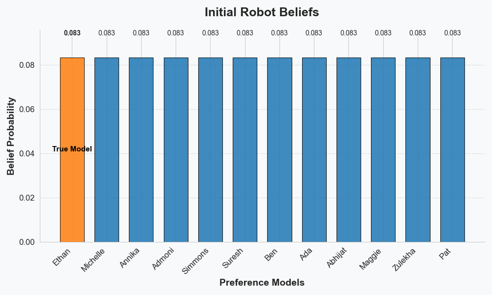
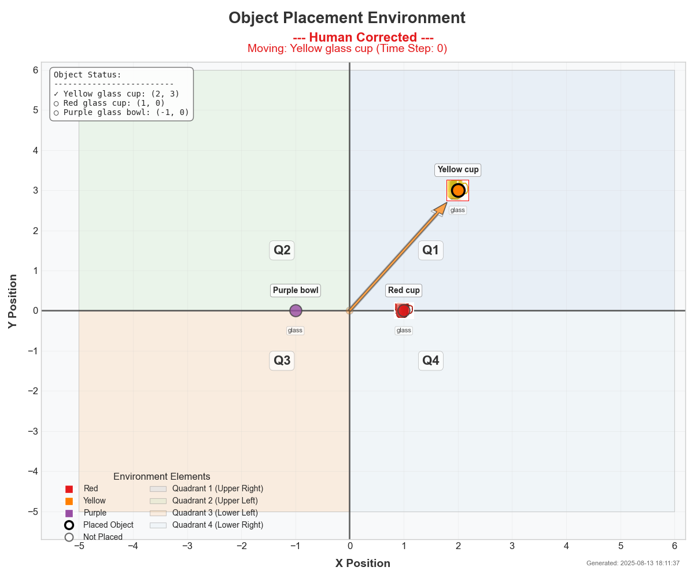

# Clarification-Guided Reward Learning

[](https://github.com/ethanvillalovoz/clarification-guided-reward-learning/actions/workflows/ci.yml)
[](https://www.python.org/)
[](LICENSE)

Research prototype for studying how robots can infer human preferences from state corrections and follow-up clarification questions.

This project was developed during the 2024 CMU Robotics Institute Summer Scholars (RISS) program. It models a multi-object placement task where a robot places cups and bowls into quadrants, receives human state corrections, updates a Bayesian belief distribution over candidate preference trees, and asks feature-level clarification questions to resolve overspecified or ambiguous feedback.

## What This Demonstrates

- A simulated Markov Decision Process for multi-object placement.
- Hierarchical preference trees over object type, color, material, and quadrant.
- Bayesian belief updates from robot actions, human corrections, and feature clarification responses.
- Research visualizations for belief evolution and object-placement rollouts.
- Linked paper, poster, presentation, and demo-video artifacts for reproducibility context.

## Visual Overview

<p align="center">
  
  <br/>
  <em>Initial belief distribution over candidate preference models.</em>
</p>

<p align="center">
  
  <br/>
  <em>Example state visualization after a human correction in the placement task.</em>
</p>

## Research Artifacts

- [Working paper](docs/paper/working-paper.pdf)
- [Research poster](docs/poster/research-poster.pdf)
- [Final presentation](docs/presentation/final-presentation.pdf)
- [Presentation video](docs/video/presentation-video.mp4)
- [Artifact notes](docs/research-artifacts.md)

## Repository Structure

```text
clarification-guided-reward-learning/
|-- archive/                 # Earlier prototypes, utility scripts, and historical rollouts
|-- beliefs/                 # Saved belief-distribution visualizations
|-- data/                    # Object and documentation images
|-- docs/                    # Paper, poster, presentation, and video artifacts
|-- rollouts/                # Saved rollout images from representative experiments
|-- src/
|   |-- clarification_guided_interaction.py
|   |-- multi_object_mdp.py
|   |-- USAGE_GUIDE.md
|   `-- utils/
|-- tests/                   # Lightweight regression tests for core simulation behavior
|-- requirements.txt
`-- README.md
```

## Quick Start

This repo targets Python 3.8+.

```bash
git clone https://github.com/ethanvillalovoz/clarification-guided-reward-learning.git
cd clarification-guided-reward-learning

python -m venv .venv
source .venv/bin/activate
python -m pip install --upgrade pip
pip install -r requirements.txt
```

Run the main research demo:

```bash
python src/clarification_guided_interaction.py
```

The demo runs the clarification-guided interaction loop, displays matplotlib visualizations, and writes belief plots to `beliefs/`.

## Verification

Run the lightweight local checks:

```bash
python -m py_compile src/clarification_guided_interaction.py src/multi_object_mdp.py src/utils/console.py
python -m unittest discover tests
```

Optional Docker check using the declared Python runtime:

```bash
docker run --rm -v "$PWD":/workspace -w /workspace python:3.8-slim sh -lc \
  "python -m pip install --upgrade pip && \
   pip install -r requirements.txt && \
   python -m py_compile src/clarification_guided_interaction.py src/multi_object_mdp.py src/utils/console.py && \
   python -m unittest discover tests"
```

## Core Files

- `src/clarification_guided_interaction.py` is the main experiment loop for robot actions, human corrections, Bayesian belief updates, clarification questions, and belief visualization.
- `src/multi_object_mdp.py` defines the Gridworld environment, object metadata, preference trees, reward lookup, transitions, value iteration, and rollout rendering.
- `src/utils/console.py` provides structured terminal output for research demos and debugging.
- `src/USAGE_GUIDE.md` explains how the source files fit together and where to modify experiment settings.

## Extending The Project

Useful extension points include:

- Add or modify preference trees in `src/multi_object_mdp.py`.
- Change the object set or true preference model in `run_interaction()`.
- Replace the scripted clarification step with a natural-language or information-gain-based question policy.
- Add tests for new reward, belief-update, or rendering behavior before changing the interaction loop.

## Status And Limitations

This is a research prototype, not a packaged robotics library. The current implementation focuses on a simulated object-placement environment and an interactive visual demo. The `archive/` directory keeps earlier prototypes and utility scripts for historical context; it is not required for the main run path.

## Acknowledgments

This work was conducted as part of the CMU Robotics Institute Summer Scholars (RISS) Program 2024. Special thanks to Dr. Henny Admoni, Dr. Reid Simmons, Michelle Zhao, Rachel Burcin, and Dr. John Dolan for mentorship and program support.

## License

This project is released under the [MIT License](LICENSE).
