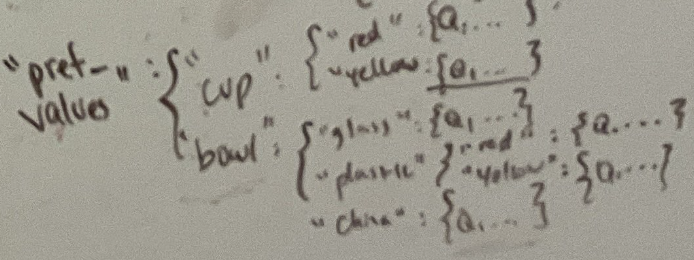
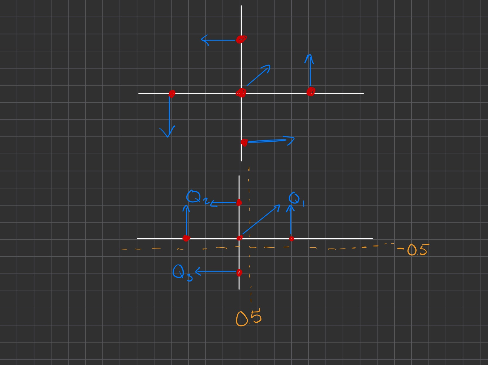

# Tree-structured Preference MDP - Version 3 Notes

## Key Changes from Version 2

- **Feature Representation Change**:
  - Previous: `[orientation, red_proximity, blue_proximity, y_position]`
  - New: Quadrant-based rewards - `[Q1, Q2, Q3, Q4]`

- **User Preference Structure**:
  - Implemented hierarchical preference tree:
    - First level: Object type (cup, bowl)
    - Second level: Object property (color for cups, material for bowls)
    - Third level: Quadrant preferences with numerical values
  
  

- **Reward Calculation**:
  - Removed `featurize_state()` method which used centroid distances
  - Added `lookup_quadrant_reward()` which traverses the preference tree

- **Grid Representation**:
  - Modified coordinate system with offset axis lines (x+0.5, y-0.5)
  - Ensures clear quadrant boundaries for reward calculation
  
  

## Implementation Details

### Preference Tree Structure

```python
preference_tree = {
    'pref_values': {
        "cup": {                            # Object type
            'red': {                        # Color
                'Q1': 10, 'Q2': -1,         # Quadrant preferences
                'Q3': -1, 'Q4': 41
            },
            'yellow': {
                'Q1': 45, 'Q2': -1,
                'Q3': 100, 'Q4': -1
            }
        },
        'bowl': {                           # Object type
            'glass': {                      # Material
                'Q1': -1, 'Q2': 5,          # Quadrant preferences
                'Q3': -1, 'Q4': 10
            },
            'plastic': {
                'Q1': -1, 'Q2': 10,
                'Q3': -1, 'Q4': -1
            },
            'china': {
                'Q1': -1, 'Q2': 5,
                'Q3': 90, 'Q4': 5
            }
        }
    }
}
```

### Object Definition Format

```python
obj = {
    'object_type': 'cup',    # Type of object (cup, bowl)
    'color': 'yellow',       # Color (red, yellow, purple, etc.)
    'material': 'glass',     # Material (glass, plastic, china)
    'object_label': 1        # Unique identifier
}
```

## Performance Testing

### Test 1: Two Similar Objects in Small Environment
- **Objects**:
  - Cup (yellow, glass)
  - Cup (red, glass)
- **Grid Size**: 5×5 (-2→3, -2→3)
- **Results**:
  - States: 3,600
  - Status: Completed successfully

### Test 2: Two Similar Objects in Medium Environment
- **Objects**:
  - Cup (yellow, glass, label 1)
  - Cup (red, glass, label 2)
- **Grid Size**: 7×7 (-3→4, -3→4)
- **Results**:
  - States: 14,112
  - Status: Completed successfully
  - *Note: Works with identical objects as well*

### Test 3: Different Object Types in Medium Environment
- **Objects**:
  - Cup (yellow, glass, label 1)
  - Bowl (purple, china, label 3)
- **Grid Size**: 7×7 (-3→4, -3→4)
- **Results**:
  - States: 14,112
  - Status: Completed successfully

### Test 4: Single Object in Medium Environment
- **Objects**:
  - Cup (yellow, glass, label 1)
- **Grid Size**: 7×7 (-3→4, -3→4)
- **Results**:
  - States: 196
  - Status: Completed successfully
  - *Note: State count matches the original `simplified_preference_mdp`*

### Test 5: Three Objects in Small Environment
- **Objects**:
  - Cup (yellow, glass, label 1)
  - Cup (red, glass, label 2)
  - Bowl (purple, china, label 3)
- **Grid Size**: 5×5 (-2→3, -2→3)
- **Results**:
  - States: 193,200
  - Status: **Failed** - computer crashed during vector calculations
  - *Note: Failed even with smaller grid size*

### Test 6: Single Object in Small Environment
- **Objects**:
  - Cup (yellow, glass, label 1)
- **Grid Size**: 5×5 (-2→3, -2→3)
- **Results**:
  - States: 100
  - Status: Completed successfully

## State Space Analysis

| Grid Size | Objects | State Count | Completion |
|-----------|---------|-------------|------------|
| 5×5       | 1       | 100         | ✓ |
| 7×7       | 1       | 196         | ✓ |
| 5×5       | 2       | 3,600       | ✓ |
| 7×7       | 2       | 14,112      | ✓ |
| 5×5       | 3       | 193,200     | ✗ |

## Performance Limitations

- **State Explosion**: The state space grows exponentially with:
  - Number of objects
  - Grid size
  - Action space (hold/place actions)

- **Maximum Configuration**:
  - 2 objects in 7×7 grid (~14K states)
  - 3 objects in 5×5 grid exceeds memory capacity

## Future Optimization Ideas

- Implement approximate value iteration
- Use hierarchical planning to reduce state space
- Parallelize state enumeration process
- Consider Monte Carlo Tree Search for larger scenarios
